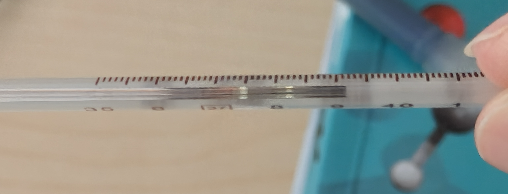

+++
date = '2026-04-01T14:31:04+08:00'
title = '月考高烧'
categories = 'moments'
description = '疫情次密接以来第一次不考月考。'

+++

- 约 4:00：全身不停地打寒战，完全无法重新入睡，甚至还感觉呼吸有点困难，不光感觉气道狭窄，一呼吸还感觉就要咳嗽。一开始以为是考试前心里因素，但是想想一个月考我怎么可能这么紧张。
- 4:22：如是颤了二十多分钟，有点慌了，不知道是什么病（从来没有出现过类似的症状），爬起来问了问 AI，被吓一跳（AI 在医疗建议方面有时候还是有点夸张了），但是考虑到还要月考，还是睡觉重要。
- 约 4:45：彻底绷不住了，打寒战打得停不下来，跟 AI 说话都说不利索，在流利度方面跟 yhc 差不多了。打开灯，发现视觉有点闪烁，问了下 AI，又被吓一大跳。但我现在感觉大概率只是眼睛还没适应光线。
- 约 5:00：被 AI 吓傻了，爬起来叫我爸我妈，我妈认为是昨天晚上发烧吃了快克的副作用，让我继续睡觉，但疯狂打颤也睡不着啊！
- 约 5:30：由于呼吸不畅这个症状有点吓人，还是带我去医院了。去医院之前，打颤这个症状神奇地消失了。抽了血化验+做了流感咽拭子，要 30 分钟才能取结果。
- 约 6:00：拿到了结果，发现只有包括白细胞、淋巴细胞、中性粒细胞等少数几个项目不大正常，其他都正常。流感显示的也是阴性。把检验结果给医生，医生又量了下血压心率体温，发现分别为 142, 78, 38.9，有点迷惑。结合之前发现有点咽炎，就开了点消炎药和退烧药就走了。
- 约 6:20：到家，开始激烈的心里斗争，要不要月考呢？从医院回来的路上，我感觉已经有点受不了持续高烧了，眼睛都在发热，有点睁不开。再加上呼吸道还是有点敏感。再加上体温量出来又变成 39.2 了。感觉肯定扛不住一天快 7 个小时的考试，还是在家乖乖保命要紧。万一真考着考着出点啥其他大症状，或者重新开始打颤，那我还考个啥？于是还是谨遵医嘱地吃了药去休息去了。
- 约 12:00：在经历了一个多小时的翻江倒海地睡不着之后，一觉睡到了 12:00！感觉退烧药还是有用的，体感上已经不咋烧了，只是头还是晕的。重新测了下体温，只有 37.5 了！于是就爬起来吃饭，刷了会儿新闻（Claude 居然开源了！），开始正常学习...

结论：还好不是期中考或者更重要的考试。以后还是别在考前吃没吃过、不知道副作用的药了！

